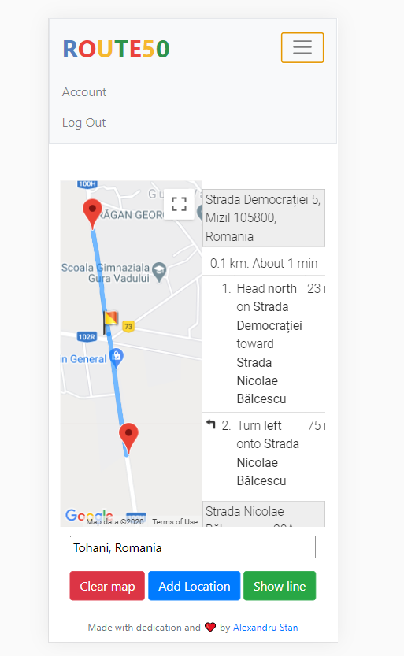

# route50
Route50 is a web-app for creating map-routes with more than 25 stop-overs/waypoints.


## Table of contents
* [General info](#general-info)
* [Example](#example)
* [Technologies](#technologies)
* [Setup](#setup)
* [Features](#features)
* [Inspiration](#inspiration)
* [Contact](#contact)

## General info
Route50 is a web-application meant to help individuals that deliver goods, so that they can easily set their route with more than 25 locations(Google Maps limit).
I created this as a response to the struggle that I've experienced in my previous job, while trying to deliver my products to the clients and couldn't easily set a route for the next day(at least not for free).

## Example
Here is a quick view of its functionality:

[](https://youtu.be/gjCzBCc-Zt8)



## Technologies
The main technologies used are:
* Python 3 - version 3.8.5
* Flask - version 1.1.2
* Jinja2 - version 2.11.2
* Google Maps API - version 3
* Bootstrap - version 4.1.3
* jQuery - version 3.3.1

The contents of Requirements.txt for setting up a virtual env.
* cachelib==0.1.1
* certifi==2020.6.20
* chardet==3.0.4
* click==7.1.2
* Flask==1.1.2
* Flask-Session==0.3.2
* idna==2.10
* itsdangerous==1.1.0
* Jinja2==2.11.2
* MarkupSafe==1.1.1
* requests==2.24.0
* urllib3==1.25.10
* Werkzeug==1.0.1

## Setup
This is you install python dependencies listed above:
```
mkdir my_project 
python -m venv my_project\venv 
my_project\venv\Scripts\activate.bat
pip install -r requirements.txt 

```

## Code Examples
* Setting up localStorage for data-saving:
```
localStorage.setItem('all_locations', JSON.stringify(all_locations));
```
* Retrieving data from localStorage, once set-up:
```
locations = JSON.parse(localStorage.getItem("all_locations"));
        all_locations.push(...locations);
```


## Features
List of features ready and TODOs for future development
* Can set up markers by clicking on the map
* Waypoints have different icons on the map
* Any marker on the map(including those already existing on the map) can provide additional info
* LatLng bounds extend with each marker added
* Thanks to localStorage, data can be retrieved after leaving the page
* New route can be rendered after deleting the previous one
* Route optimisation, up to 25 waypoints

To-do list:
* Extend the limit for route optimisation - can be done by moving all data processing to back-end
  instead of making API calls
* Implementing voice-assistant


## Inspiration
Project based on the CS50's Finance project for the server-side, using their examples to setup routes in Flask
https://finance.cs50.net/


## Contact
Created by [@AlexStan](https://github.com/alexstan12) - feel free to contact me!


